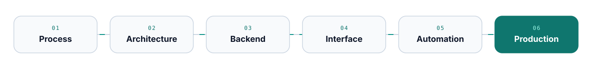

  
  
  

 

## ⚡ Shipped and running

<table>
  <tr>
    <td width="58%">
      
    </td>
    <td width="42%" valign="middle">
      <code>01</code> &nbsp;OWN PRODUCT
      <h3><a href="https://dppc.pl/">DPPC</a></h3>
      <b>Digital Product Passport Cloud</b>
      
Turns scattered product documents into structured passports: product data, compliance files, public product cards and QR access for manufacturers and importers.

      <code>Laravel</code> <code>Product data</code> <code>QR</code> <code>API</code>
        
      <a href="https://dppc.pl/"><b>Open the product →</b></a>
    </td>
  </tr>
</table>

<table>
  <tr>
    <td width="42%" valign="middle">
      <code>02</code> &nbsp;CLIENT SYSTEM
      <h3><a href="https://jirasoft.pl/portfolio/revend-integracje-rvm">Revend</a></h3>
      <b>Reverse vending and deposit return</b>
      
Operations panel and backend behind RVM machines: transaction exports, partner APIs (Kaucja, Polka, Forcom, Reselect), scheduled jobs, log analysis and error monitoring.

      <code>Laravel</code> <code>REST API</code> <code>Queues</code> <code>Docker</code>
        
      <a href="https://jirasoft.pl/portfolio/revend-integracje-rvm"><b>Read the case study →</b></a>
    </td>
    <td width="58%">
      
    </td>
  </tr>
</table>

<table>
  <tr>
    <td width="58%">
      
    </td>
    <td width="42%" valign="middle">
      <code>03</code> &nbsp;OWN ECOSYSTEM
      <h3><a href="https://jirachem.pl/">JiraChem</a></h3>
      <b>B2B commerce platform</b>
      
Product selection, customer panel, carts, quotes, orders, stock and back-office workflows, all in one Laravel and Inertia system.

      <code>Laravel</code> <code>Inertia.js</code> <code>Vue</code> <code>B2B</code>
        
      <a href="https://jirachem.pl/"><b>Open the platform →</b></a>
    </td>
  </tr>
</table>

## 🧪 Product lab

<table>
  <tr>
    <td width="33%" valign="top">
      
        
      <b><a href="https://jirasoft.pl/tenderiq">TenderIQ</a></b> 
      Search and monitoring of public tenders with CPV context, buyers and deadlines.
    </td>
    <td width="33%" valign="top">
      
        
      <b><a href="https://dealerpilot.pl/">DealerPilot</a></b> 
      CRM workflow for vehicle dealers: leads, quoting and customer follow-up.
    </td>
    <td width="33%" valign="top">
      
        
      <b><a href="https://field-reports.greenaxe.pl/">GreenAxe Field Reports</a></b> 
      Field work reporting: visits, notes, photos, PIN access and PDF summaries.
    </td>
  </tr>
  <tr>
    <td width="33%" valign="top">
      
        
      <b><a href="https://jirasoft.pl/portfolio/inspirion-gmbh">LEO API · Inspirion</a></b> 
      API layer for products, pricing, variants, customers and orders. CTO-level B2B work.
    </td>
    <td width="33%" valign="top">
      
        
      <b><a href="https://jirasoft.pl/demo-terracecraftstudio">Terrace Craft Studio</a></b> 
      Service presentation that takes a visitor from inspiration to a qualified inquiry.
    </td>
    <td width="33%" valign="top">
       
      <b><a href="https://brokersync.pl/">BrokerSync</a></b> 
      CRM/ERP for insurance brokers: clients, policies, tasks and reminders.
        
      <b>More client work</b> 
      
        <b>Brewers</b> · UK retail portal and mobile app 
        <b>Seallecdis</b> · industrial inspection platform 
        <b>OGV Energy</b> · media platform and app 
        <b>Fabric / Aviva</b> · pension tracker 
        <b>SEKOP 2</b> · large internal system
      
    </td>
  </tr>
</table>

Most of this code is commercial and private. The full case studies are at <a href="https://jirasoft.pl/portfolio">jirasoft.pl/portfolio</a>.

## 🧭 How I work

I start from how the business operates, not from the screen. That means mapping the workflow and the data first, designing modules, permissions and integrations before the product grows messy, and only then building the backend, the interface and the automation around it.

## 🛠 Stack

  

  PHP 8 · Laravel 11/12 · Vue 3 · React · TypeScript · Inertia.js · Tailwind · PostgreSQL · MySQL · Redis · Docker · AWS · Ionic / Capacitor

## 📬 Let's talk

> Got a process that has outgrown spreadsheets, a B2B portal to build, or integrations that need to become reliable? That is the work I like most.

  
  

